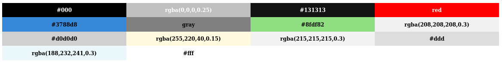

# Palette  

_Display colors in from a css file sorted by luminance_  

  

---  

## Usage:  
1. Build the HTML file:  
    - `./build <path_to_css_file>`  

### Synopsis:  

`build` scans the css file for colors and then sorts them according to
[perceptual brightness](https://en.wikipedia.org/wiki/Luma_%28video%29) it
displays them with their names from the css file.  
